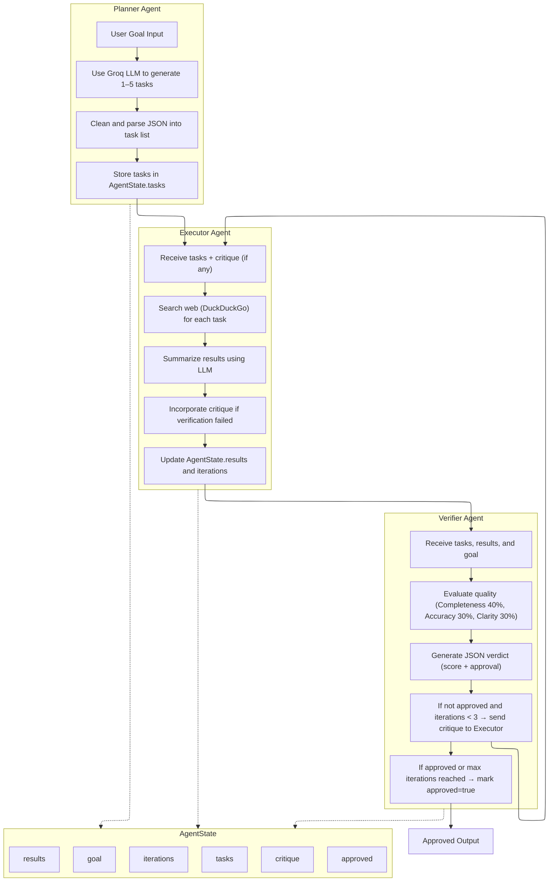

# Agent Workflow Diagram

## Multi-Agent Research & Validation System

## Workflow Overview

- **Planner:** Decomposes the user goal into 1–5 concrete tasks
- **Executor:** Performs web searches and LLM-based summarization for each task
- **Verifier:** Quality-checks results and provides critique for refinement
- **Loop:** If not approved and iterations < 3, feedback cycles back to Executor
- **Exit:** Approved output or max iterations (3) reached

**Shared State:** All agents read/write to `AgentState` containing goal, tasks, results, critique, approval status, and iteration count.
